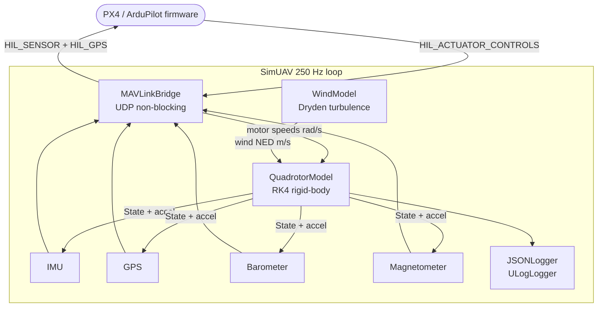

# SimUAV

[](https://github.com/AlejandroCastilloBurgos/SimUAV/actions/workflows/ci.yml)

SimUAV is a headless C++17 Software-in-the-Loop (SIL) quadrotor simulator designed for drone firmware CI/CD. It connects to real PX4 or ArduPilot firmware over UDP, feeds it simulated sensor data (IMU, GPS, barometer, magnetometer), and receives motor commands back — creating a closed-loop HIL session without any physical hardware.

---

## Prerequisites

| Dependency | Version | Install |
|------------|---------|---------|
| CMake | ≥ 3.16 | `sudo apt install cmake` |
| Eigen3 | ≥ 3.3 | `sudo apt install libeigen3-dev` |
| GCC | ≥ 11 (C++17) | `sudo apt install build-essential` |
| MAVLink headers | c_library_v2 | see below |

GoogleTest is fetched automatically by CMake via `FetchContent` on first build.

**MAVLink headers (one-time clone):**
```bash
git clone https://github.com/mavlink/c_library_v2.git third_party/mavlink-c-library
```

---

## Build

```bash
# Debug (default for development)
cmake -B build -DCMAKE_BUILD_TYPE=Debug
cmake --build build -j$(nproc)

# Release
cmake -B build -DCMAKE_BUILD_TYPE=Release
cmake --build build -j$(nproc)
```

---

## Run

```bash
./build/simuav
```

SimUAV reads `config/default.json` on startup (falls back to built-in defaults if the file is absent). All parameters — physics, sensors, wind, logging — are configurable there.

---

## Tests

```bash
ctest --test-dir build --output-on-failure

# Run a single suite directly (faster, no ctest overhead):
./build/tests/simuav_tests --gtest_filter="QuadrotorModel.*"
```

---

## Connecting to PX4 SITL

SimUAV speaks the MAVLink HIL protocol over UDP:

| Direction | Port | Message |
|-----------|------|---------|
| SimUAV → PX4 | 14560 | `HIL_SENSOR` (250 Hz), `HIL_GPS` (5 Hz) |
| PX4 → SimUAV | 14561 | `HIL_ACTUATOR_CONTROLS` |

**Quickstart:**

1. Build PX4 with HIL support and launch it in HIL mode:
   ```bash
   # In the PX4-Autopilot repo:
   make px4_sitl_default none
   # or, to use the HITL config:
   HEADLESS=1 make px4_sitl none_iris
   ```

2. In a second terminal, start SimUAV:
   ```bash
   ./build/simuav
   ```

3. PX4 and SimUAV will handshake automatically. Use QGroundControl or
   `mavproxy.py` on port 14550 to monitor state.

> **Ports:** If your PX4 config uses different ports, update `mavlink_host`
> and `mavlink_port` in `config/default.json`.

---

## Connecting to ArduPilot SITL

SimUAV supports ArduPilot Copter SITL via the `ardupilotmega` MAVLink dialect.
Motor commands arrive as `RC_CHANNELS_OVERRIDE` (PWM 1000–2000 µs) instead of
`HIL_ACTUATOR_CONTROLS`.

| Direction | Port | Message |
|-----------|------|---------|
| SimUAV → ArduPilot | 9002 | `HIL_SENSOR` (250 Hz), `HIL_GPS` (5 Hz) |
| ArduPilot → SimUAV | 9003 | `RC_CHANNELS_OVERRIDE` |

**Quickstart:**

1. Start ArduPilot Copter SITL (headless):
   ```bash
   # In the ardupilot repo:
   Tools/autotest/sim_vehicle.py --vehicle ArduCopter --frame quad --no-rebuild
   ```

2. In a second terminal, start SimUAV with the ArduPilot config:
   ```bash
   ./build/simuav --config config/ardupilot_sitl.json
   ```

3. ArduPilot and SimUAV will handshake automatically. Use MAVProxy or
   QGroundControl on port 14550 to monitor state.

> **Key config difference:** `config/ardupilot_sitl.json` sets
> `"firmware_target": "ardupilot"` and `"mavlink_port": 9002`.
> These match ArduPilot SITL's default HIL port layout.

---

## Architecture

SimUAV runs a deterministic 250 Hz loop. Each step follows a fixed order:

```
receive actuators → wind sample → physics integrate → sample sensors → send HIL → log
```



### Frame conventions

| Frame | Axes | Used for |
|-------|------|----------|
| World | NED (North/East/Down) | position, velocity, gravity |
| Body | FRD (Forward/Right/Down) | forces, torques, sensor outputs |
| Quaternion | body → NED | `State::attitude` |

### Motor layout (X-frame, top view)

```
  FL(0) ── FR(1)     FL=CW   FR=CCW
     \        /
  RL(2) ── RR(3)     RL=CCW  RR=CW
```

---

## Configuration

All parameters live in `config/default.json`. Key sections:

| Section | Notable fields |
|---------|----------------|
| `quad_params` | `mass`, `k_thrust`, `k_drag`, `esc_exponent`, `use_rk4` |
| `wind_params` | `use_dryden`, `dryden_airspeed`, `dryden_sigma_*` |
| `imu_params` | `accel_noise_std`, `gyro_noise_std`, bias random walk |
| `gps_params` | `lat_ref_deg`, `lon_ref_deg`, `update_rate_hz` |

---

## Contributing

**Branch naming:** `feature/simuav-<issue>-<slug>` or `fix/simuav-<issue>-<slug>`

**Workflow:**
1. Branch off `main`.
2. Open a pull request — CI runs automatically.
3. All tests must pass and the build must be warning-free (`-Werror`).
4. Squash-merge once approved.

See `CLAUDE.md` for code style rules (C++17 strict, header locations, zero-warning policy).
